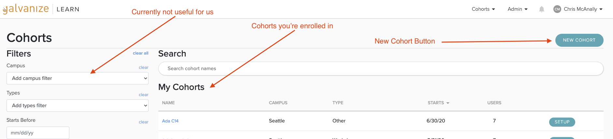
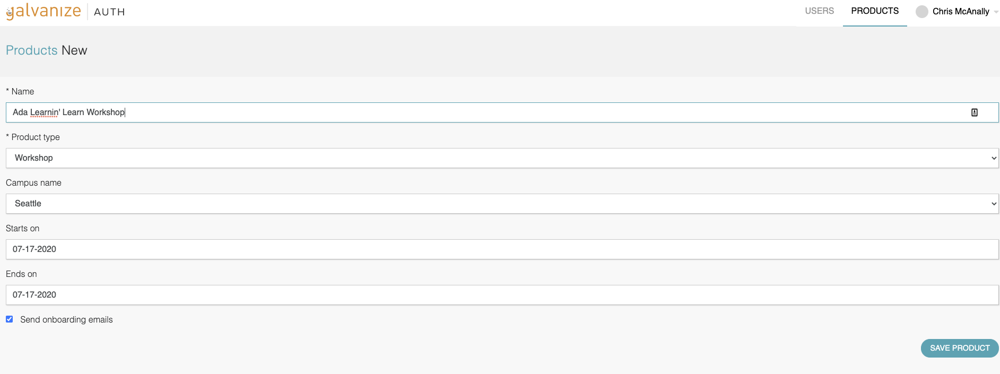
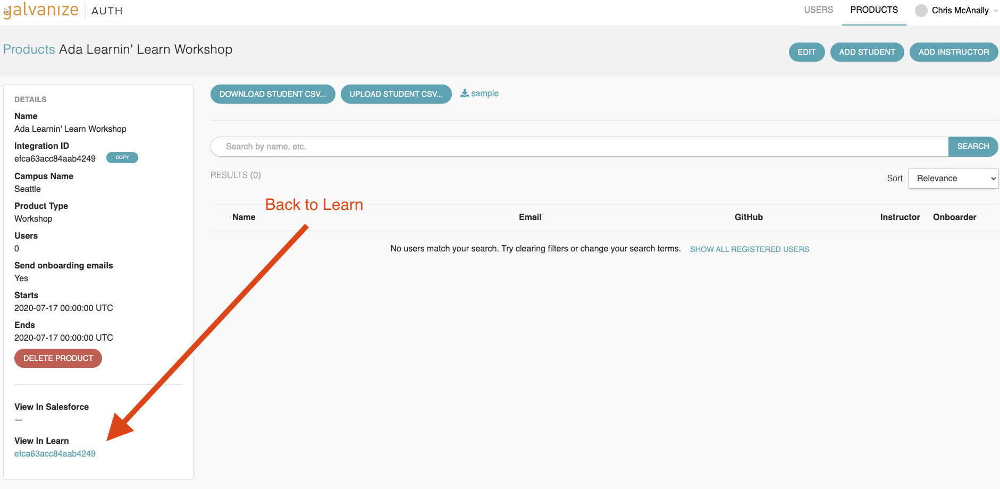

# [Learn Admins] Creating A Course

In this lesson you will create a sample course in Learn and enroll students.

<!-- available callout types: info, success, warning, danger, secondary, star  -->
### !callout-info

## Learn Admins

Only Learn Admins need to create courses. Other staff will not have the authorization to create a course.

### !end-callout

## Creating a Course in Learn

Go to the [Learn Cohorts page](https://learn-2.galvanize.com/cohorts) and Create a new sample cohort.  

<!-- available callout types: info, success, warning, danger, secondary  -->

Then fill out the form.

You can enroll students and teachers individually with the buttons, and enroll students in-bulk with a CSV file via a template. 

Notice that this brings you to Auth, which is a tool to link users with products for Galvanize.

## Back to Learn

You can find a link to your course either in the products page, or with the link at the bottom right.

