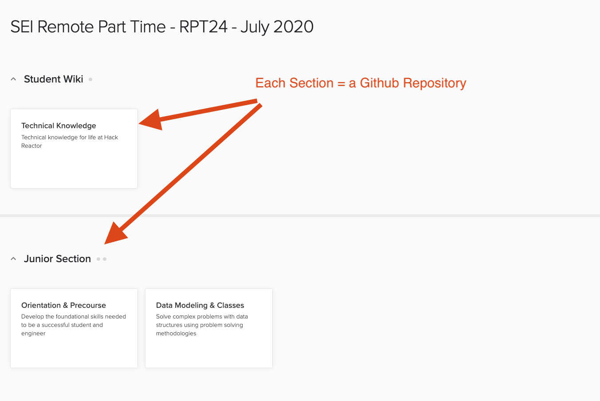
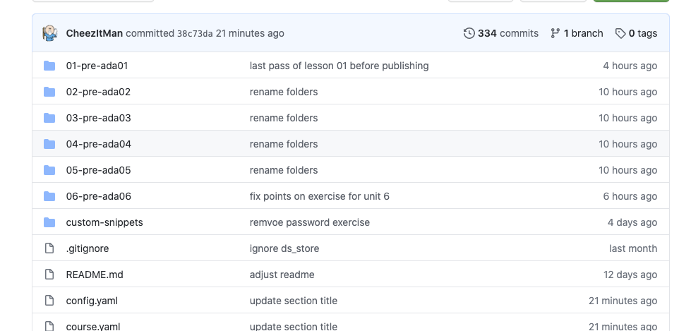
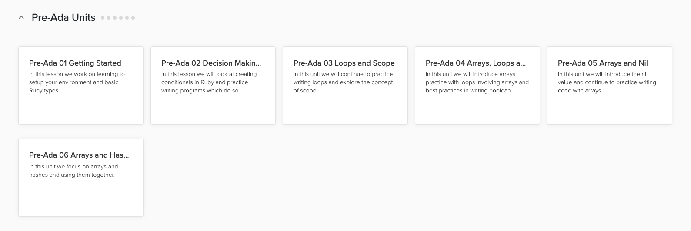
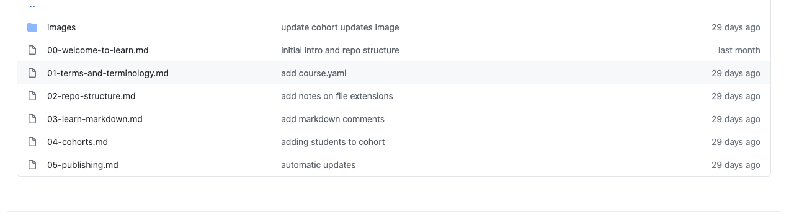
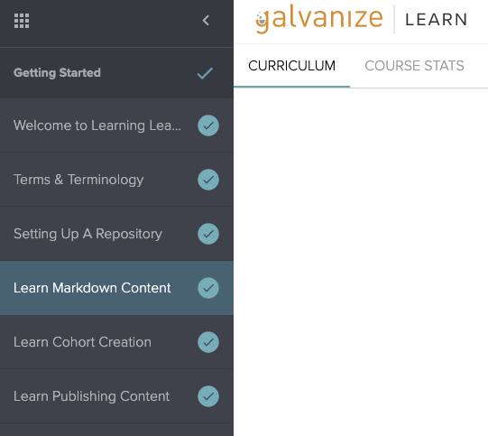

# Setting up Files & Folders

Each Cohort/Course in Learn is made up of sections, each section is a repository in Github.



Today we are just going to set up one section, since they're mostly all alike.  Each Section has several units which are collections of markdown, and other documents like PDF, or Jupyter Notebook (READ ONLY).

## Folders

You can create units with a collection of folders in your github repository.  It's a good idea to number the folders in the sequence you want students to tackle them.  





## Files

You can create markdown, PDF and even Jupyter Notebook files which contain each lesson in a unit.  Learn supports regular Github markdown, with it's own styling.

So files in Github:



In learn look like:



## Publishing

Once you are ready to see your code in Learn, you can publish the files by:

* Commiting all of them to git with
  * example:  
    * `git add .`
    * `git commit -m "fixed the thing"`
* Pushing Content to Github
  * example:
    * `git push origin master`
* Then publishing with the Learn Cli tool
  * `learn publish`


```bash
$ git add .                                
$ git commit -m "fixed the thing"          
[master 4092f2a] fixed the thing
 1 file changed, 31 insertions(+)
$ learn publish  
INFO: Using existing config.yaml. Publishing block with repo name ada-learn-workshop
Pushing work to remote origin master

Building release...
Block 835 released!
```

You might need to update the course with a release in section 4 [connecting a course and repo](./04-connecting-course-and-repo.md).

### Preview

You can also preview a repository with `learn preview .`  Then you will be given a link to preview it.  However Testable projects etc won't work.

```bash
$ learn preview .
INFO: Using existing config.yaml. Compressing your content...
√
Uploading assets to Learn...
875823 / 1555038 [------------------------------------->________________________1236271 / 1555038 [--------------------------------------------------->_________1301807 / 1555038 [------------------------------------------------------>______1416495 / 1555038 [-------------------------------------------------->____] 91.01555038 / 1555038 [----------------------------------------------------->] 100.01555038 / 1555038 [----------------------------------------------------->] 100.01555038 / 1555038 [---------------------------------------------------------] 100.00% 1395284 p/s 1s
√

Building preview...
Sucessfully uploaded your preview! You can find your content at: http://learn-2.galvanize.com/cohorts/1994
```
## Exercise

With your pair create 2-3  folders on any sample topic you want.  Within each folder create a couple of markdown files and fill them with a header on a topic of your choice.  
