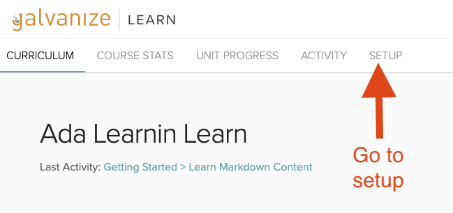
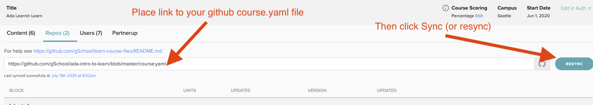
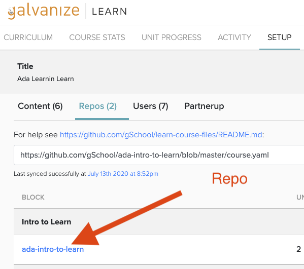
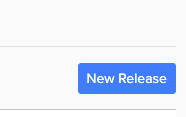
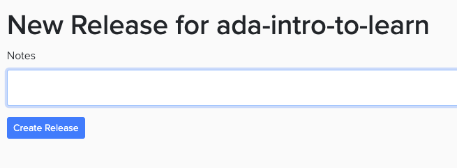

# Course.yaml

Each course you create is connected with a file called `course.yaml`.  This file lists all the repositories that your course uses.  

## Create a `course.yaml`

Below is an example `course.yaml file.

```yaml
:Course:
- :Section: Pre-Ada Units
  :Repos:
  - :Url: https://github.com/gSchool/ada-jumpstart-live-programming-workflow
```

## Exercise 

With your partner create a `course.yaml` file in the root of your repository.  Then add and commit it and push your course content up to github.

Then publish your content with:

```bash
learn publish
```

## Connecting `course.yaml` To Learn

In your Learn course go to **SETUP** and paste a link to your `course.yaml` file.  






## Further Info - Multi-repo example

Below is a multi-repo example of a course.yaml file

```yaml
:Course:
- :Section: Intro to Learn
  :Repos:
  - :Url: https://github.com/gSchool/ada-intro-to-learn
- :Section: Learning Learn Workshop
  :Repos:
  - :URL: https://github.com/gSchool/ada-learn-workshop
```

## Updating Content in the Learn Course

When you publish content to learn, it doesn't automatically update the learn course.  To do so you need to make a new "release".  

To create a new release you go to the course' setup page and click on the repo in question.


Then click on the repo in question



Then click on **New Release** to on the top-right and create a new release, notes are optional





Then you can revist the course material and see your changes.