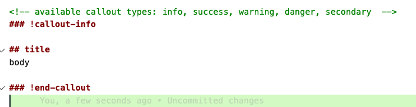
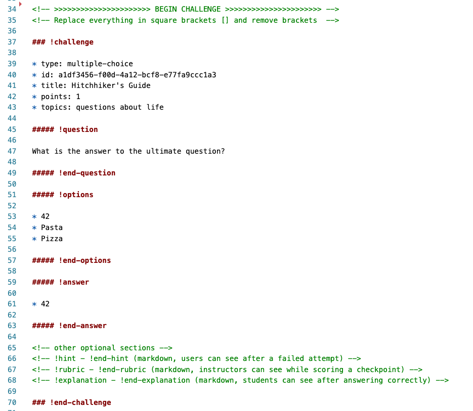

# Learn Markdown

Learn markdown is much like Github Markdown.  However there are some extra markdown items that Learn provides.

You can see a list of special markdown blocks Learn can handle by typing `learn markdown`, in the terminal.

## Callouts

You can generate callouts by using the following code.  You can generate a template for a callout by using the Learn Cli tool and typing 

## Learn Questions

Learn can also make the following questions such as:

* multiplechoice
* checkbox
* shortanswer
* number
* paragraph
* javascript
* java
* python
* sql
* customsnippet
* project
* testableproject

The multiplechoice, checkbox, shortanswer, number and many programming exercises can be automatically graded, while others require an instructor to review them.  Each question requires a unique which the learn markdown can generate.  The Learn VS code extension can also generate an ID, if you need.

An example question is:

## Exercise

With your partner create a couple of Questions in your markdown documents.  Then publish the material on Learn and view them in the LMS.  

## Special File Types

You can create other content types by following naming conventions.

*  Use the extension `.instructor.md` to make a file that is only visible to instructors.
*  Use the extension `.checkpoint.md` to make an assessment.
*  Use the file extension `.hidden.md` to make a file that starts out hidden and can be made visible later.
*  Use the file extension `.resource.md` to make a files that is accessible to students but not included in the left navigation.