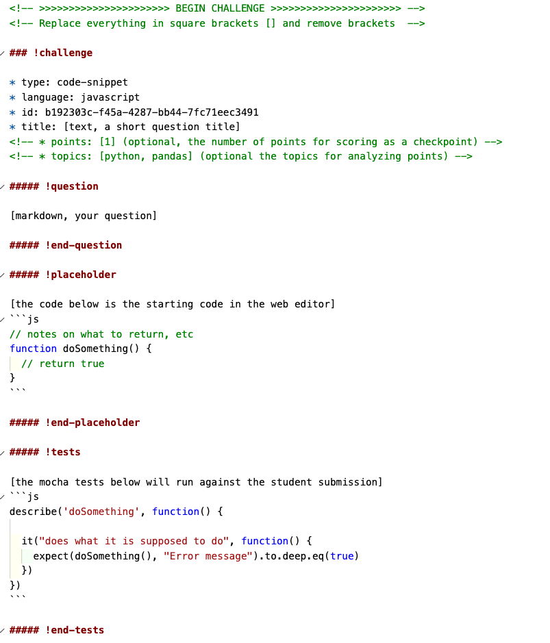

# Creating a JS Snippet

You can generate a JavaScript snippet with `learn markdown js`.  Then you can paste it into a markdown or checkpoint document and edit the content for students to answer.



You can fill in the question and provide Mocha tests to evaluate the student answer.  

## Example JS Snippet

<!-- >>>>>>>>>>>>>>>>>>>>>> BEGIN CHALLENGE >>>>>>>>>>>>>>>>>>>>>> -->
<!-- Replace everything in square brackets [] and remove brackets  -->

### !challenge

* type: code-snippet
* language: javascript
* id: 2a870767-436d-4b76-aea5-51475c62792b
* title: Reverse String
* points: 1
* topics: javascript

##### !question

Given a string and an integer k, you need to reverse the first k characters for every 2k characters counting from the start of the string. If there are less than k characters left, reverse all of them. If there are less than 2k but greater than or equal to k characters, then reverse the first k characters and left the other as original.

**Example:**

```
Input: s = "abcdefg", k = 2
Output: "bacdfeg"
```

**Restrictions:**

1. The string consists of lower English letters only.
1. Length of the given string and k will in the range [1, 10000]


##### !end-question

##### !placeholder

[the code below is the starting code in the web editor]
```js
/**
 * @param {string} s
 * @param {number} k
 * @return {string}
 */
const reverseStr = (s, k) => {
    
};
```

##### !end-placeholder

##### !tests

```js
describe('reverseStr', function() {

  it("will reverse the example", function() {
    expect(reverseStr('abcdefg', 2), "Reverse 'abcdefg' with 2").to.equal('bacdfeg')
  });

  it('will return "bacd" when given "abcd" and 2', () => {
    expect(reverseStr('abcd', 2), "Reverse 'abcd' with 2").to.equal('bacd')
  });

  it('will return "cbadef" when given "abcdef" and 3', () => {
    expect(reverseStr('abcdef', 3), "Reverse 'abcdef' with 3").to.equal('cbadef')
  });
})
```

##### !end-tests

<!-- other optional sections -->
<!-- !hint - !end-hint (markdown, users can see after a failed attempt) -->
<!-- !rubric - !end-rubric (markdown, instructors can see while scoring a checkpoint) -->
<!-- !explanation - !end-explanation (markdown, students can see after answering correctly) -->

### !end-challenge

<!-- ======================= END CHALLENGE ======================= -->