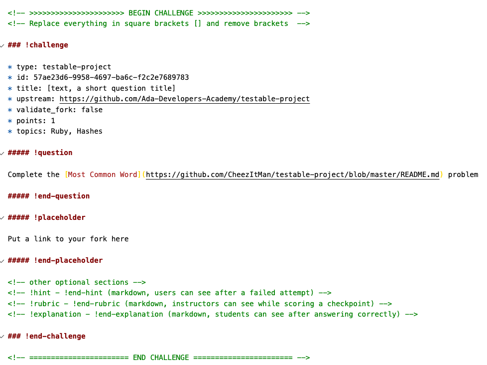
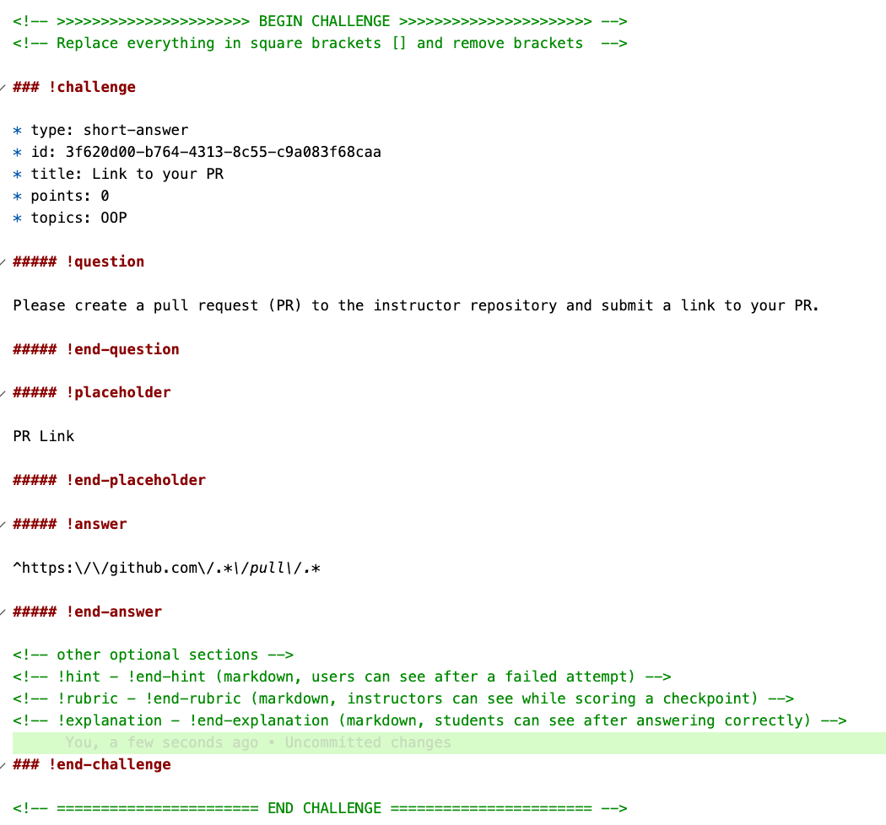

# Projects & Projects with Tests

<iframe src="https://adaacademy.hosted.panopto.com/Panopto/Pages/Embed.aspx?id=f3abba0a-26e3-44ba-8378-ac210148f226&autoplay=false&offerviewer=true&showtitle=true&showbrand=false&start=0&interactivity=all" height="405" width="720" style="border: 1px solid #464646;" allowfullscreen allow="autoplay"></iframe>

Project challenges allow students to do work outside of learn and submit links to their code. These can be PR links, Repl.it links or Gists.  Regular project submissions are **not automatically graded**.

## Project Assignment with No Tests

You can generate the markdown below with `learn markdown pr` from the terminal.


### Project Fields

* **topics** - Helpful to group assessments for seeing areas of concern
* **points** - Chris suggests scoring all projects out of 2, 0 = Red, 1 = Yellow, 2 = Green
* **hint** - Show to the user prior to submission
* **rubric** - This only shows to students can can be a table like we've done before to provide grading guidence.  It also shows RENDERED markdown so we can't just copy and paste into comments.
* **explanation** - Students only see this after answering **correctly**, not good for correcting errors.

<!-- available callout types: info, success, warning, danger, secondary  -->
### !callout-danger

## Explanation only gets seen on success

I just want to "call-out" that the explanation block is only seen after the student has **successfully** submitted a project/question.

### !end-callout

## Example Project Question

<!-- >>>>>>>>>>>>>>>>>>>>>> BEGIN CHALLENGE >>>>>>>>>>>>>>>>>>>>>> -->
<!-- Replace everything in square brackets [] and remove brackets  -->

### !challenge

* type: project
* id: 64058bd9-f61c-494b-a3b9-7197378be53b
* title: Regular Project Example
* points: 1
* topics: ruby, intro

##### !question

Given a paragraph and a list of banned words, return the most frequent word that is not in the list of banned words.  It is guaranteed there is at least one word that isn't banned, and that the answer is unique.

Words in the list of banned words are given in lowercase, and free of punctuation.  Words in the paragraph are not case sensitive.  The answer is in lowercase.

 

**Example:**

```txt
Input: 
paragraph = "Bob hit a ball, the hit BALL flew far after it was hit."
banned = ["hit"]

Output: "ball"
Explanation: 
"hit" occurs 3 times, but it is a banned word.
"ball" occurs twice (and no other word does), so it is the most frequent non-banned word in the paragraph. 
Note that words in the paragraph are not case sensitive,
that punctuation is ignored (even if adjacent to words, such as "ball,"), 
and that "hit" isn't the answer even though it occurs more because it is banned.
```

**Note:**

* 1 <= paragraph.length <= 1000.
* 0 <= banned.length <= 100.
* 1 <= banned[i].length <= 10.
* The answer is unique, and written in lowercase (even if its occurrences in paragraph may have uppercase symbols, and even if it is a proper noun.)
paragraph only consists of letters, spaces, or the punctuation symbols !?',;.
* There are no hyphens or hyphenated words.
* Words only consist of letters, never apostrophes or other punctuation symbols.

##### !end-question

##### !placeholder

Your link goes here

##### !end-placeholder

<!-- other optional sections -->
##### !hint

This is a **really** bad hint!

##### !end-hint

##### !rubric

##### !end-rubric

##### !explanation


##### !end-explanation

### !end-challenge

<!-- ======================= END CHALLENGE ======================= -->

## Projects with Instructor Tests

These are projects where the student is given a github repo.  They normally fork the repo (but aren't required) and they submit a link to a repo.  It's useful to note that the project being tested does **not** have to be in gSchool!

* [Example Testable Project](https://github.com/adagold/linked-list)

### How They Work

Setup:

1.  The instructor sets up an Exercise Repo (like a project repo).
    *  The repo is set up with Docker to run the tests automatically much like a Custom Snippet   
1.  The instructor puts the testable project markdown into the Learn Checkpoint or lesson.

At the Student Level

1.  Students  fork/clone/work/test/push for an exercise repo. Student submits fork with their work back into Learn.
  * Note it says **fork** not PR
1. Learn clones the fork and upstream repos.
1. Using a Dockerfile from the upstream repo, Learn builds a container, adds code to be tested, and installs dependencies.
1. Learn runs tests.
1. Learn displays test results (exit code + stdout) for student and instructor.


## How to set them up

[Dan](https://github.com/gSchool/ada-4) has a good example of a JavaScript testable project repository.  You will need to set these up, which is much like our normal projects, with tests.  The only major changes are a `Dockerfile` and a `test.sh` file which has how to run the tests.

You will need to setup a Dockerfile like this one for JS:

```Dockerfile
# Install latest version of node (older versions are not guaranteed to work with Learn)
FROM node:latest

# Install bash (must be installed for alpine builds)
# RUN apk update && apk add bash

# Create directory for app
RUN mkdir /app

# Set as current directory for RUN, ADD, COPY commands
WORKDIR /app

# Add to PATH
ENV PATH /app/node_modules/.bin:$PATH

# Add package.json from upstream
ADD package.json /app

# Install dependencies
RUN npm install

# Add entire student fork (overwrites previously added package.json)
ARG SUBMISSION_SUBFOLDER
ADD $SUBMISSION_SUBFOLDER /app

# Overwrite files in student fork with upstream files
ADD test.sh /app
ADD package.json /app
ADD src/data_structures/test /app/src/data_structures/test
```

An example `test.sh` file is like this:

```bash
#!/bin/bash


npm run grade
```

I also have a [demo Ruby testable project repo.](https://github.com/adagold/linked-list).


## Example - Markdown and result



<!-- >>>>>>>>>>>>>>>>>>>>>> BEGIN CHALLENGE >>>>>>>>>>>>>>>>>>>>>> -->
<!-- Replace everything in square brackets [] and remove brackets  -->

### !challenge

* type: testable-project
* id: 57ae23d6-9958-4697-ba6c-f2c2e7689783
* title: Sample Testable Project
* upstream: https://github.com/Ada-Developers-Academy/testable-project
* validate_fork: false
* points: 1
* topics: Ruby, Hashes

##### !question

Complete the [Most Common Word](https://github.com/CheezItMan/testable-project/blob/master/README.md) problem

##### !end-question

##### !placeholder

Put a link to your fork here

##### !end-placeholder

<!-- other optional sections -->
<!-- !hint - !end-hint (markdown, users can see after a failed attempt) -->
<!-- !rubric - !end-rubric (markdown, instructors can see while scoring a checkpoint) -->
<!-- !explanation - !end-explanation (markdown, students can see after answering correctly) -->

### !end-challenge

<!-- ======================= END CHALLENGE ======================= -->


### Testable Project Fields of note

* **upstream** - Lists the instructor project repository
* **validate_form** - True or False value, if you want to require the submission to be a fork
* **hint** - Students can see this after a failed submission
* **rubric** - Only instructors see this when grading
* **explanation** - Students only see this after **Successfully** submitting.
* **Title**
* **Points** - Chris suggests scoring projects out of 2, 0 = Red, 1 = Yellow and 2 = Green
* **!Question**  - The project question
* **Placeholder**

## Example Testable Project Files - Ruby

### Gemfile

```ruby
# frozen_string_literal: true
source "https://rubygems.org"

gem 'rake'
gem 'minitest'
gem 'minitest-spec'
gem 'minitest-reporters'
gem "pry"
gem 'minitest-skip'
```

### Dockerfile

```Dockerfile
# Starting from a minimalist image
FROM ruby:2.7

# Install bash (must be installed for alpine builds)
# RUN apk update && apk add bash

# Reference for help contact me
LABEL maintainer="chris@adadev.org"

# Create a directory for the app
RUN mkdir /app

# Set the working directory for RUN, ADD and COPY
WORKDIR /app

# Add entire student fork (overwrites previously added Gemfile & Tests)
ARG SUBMISSION_SUBFOLDER
ADD $SUBMISSION_SUBFOLDER /app

# Optional - Copy Gemfile over and install Gems
# COPY ./Gemfile .

RUN gem install bundler
RUN bundle install

# Copy over bash runner
ADD test.sh .
# Copy over Rakefile
ADD Rakefile .
# Copy over tests
ADD ./test .

RUN chmod +x test.sh
```

### test.sh

```bash
#!/bin/bash

rake
```

### Creating a Project with Student Tests

For a testable project with student tests you can use the same template as above but remove lines which copy over instructor tests and gemfile from the Dockerfile.

This results in the following Dockerfile

```Dockerfile
# Starting from a minimalist image
FROM ruby:2.7
# Reference for help contact me
LABEL maintainer="chris@adadev.org"

# Create a directory for the app
RUN mkdir /app

# Set the working directory for RUN, ADD and COPY
WORKDIR /app

# Add entire student fork (overwrites previously added files)
ARG SUBMISSION_SUBFOLDER
ADD $SUBMISSION_SUBFOLDER /app

RUN gem install bundler
RUN bundle install

RUN chmod +x test.sh
```

## But what about PR Reviews???!!!

For PR reviews you can have students submit their PR as a short-answer question and then comment on them.  For example



## Resources

* [Official Learn Documentation on Project Challenges](https://learn-2.galvanize.com/cohorts/667/blocks/13/content_files/Testing-Project-Challenges.md)


