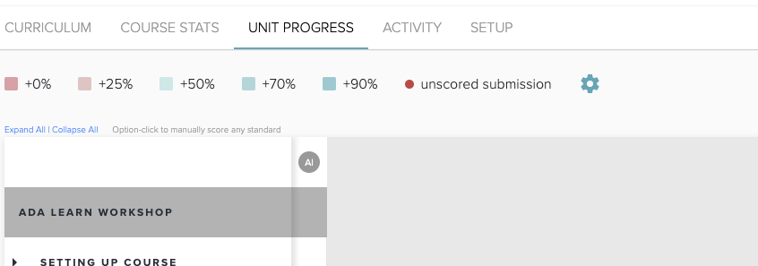
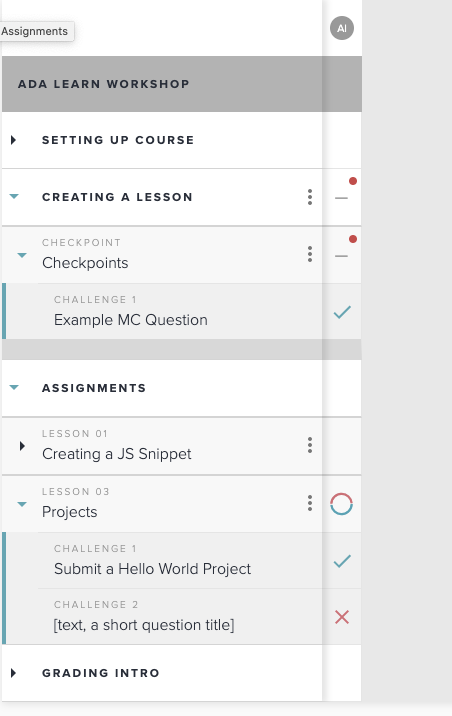

# Grading

You can view student outcomes on each challenge & assessment by going to the course **UNIT PROGRESS** tab. 

## Unit Progress

You can then see the list student grades on challenges and checkpoints.  You can use the arrows to expand units and click on specific assignments to manually grade and/or view submissions or issue comments.

## Project Feedback

Project feedback shows up on the right sidebar and supports Markdown.  Unfortunately student do not submit pull requests.  

I suggest

* We have student submit their repo for running of tests
* We also make a regular project markdown question with a link to a PR and we can give detailed feedback here.

Students will get notifications on the site when they recieve feedback from instructors. 